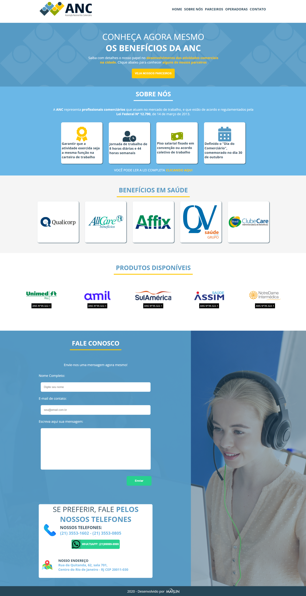

# Etapa 03 - processo seletivo Marlin

Nesta etapa, desenvolvi uma Landig Page responsiva da ANC - Associação Nacional dos Comerciários.

### Screenshot

### Links
- [repositório](https://github.com/JimCarey08/etapa_03-processoMarlin/)
- [email-live]()

## Processo de desenvolvimento

### desenvolvido com:

- HTML5
- HTML semântico
- CSS 
- CSS Flexbox

### Como foi o processo:

Ao desenvolver essa Landing page, me deparei com diversos desfaios, tais como, usar o arquivo pds para obter os vetores e imagens, após isso usei um editor para alterar as cores dos vetores. Após essa organização dos arquivos usados, utilizei em grande parte o flexbox para um melhor posicionamento das seções da pagina, tornando também responsivo.

